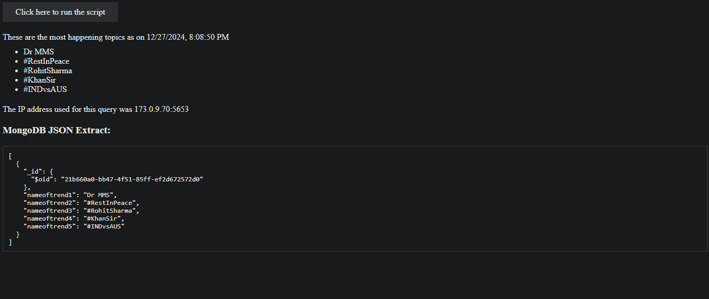

# TrendScoop

TrendScoop is a web application that displays the top 5 current trending topics on Twitter. The frontend is built with HTML and JavaScript, while the backend uses Express.js to run a Selenium script to fetch the top trending topics from Twitter. The data is stored in a MongoDB database and returned to the frontend for display.

## Features

- **Frontend**: Displays the top 5 trending topics from Twitter.
- **Backend**: Uses Express.js and a Selenium script to scrape Twitter's trending topics.
- **Database**: MongoDB stores the fetched trending topics.
- **Real-time Data**: Fetches and displays the latest trending topics whenever the user accesses the frontend.

## Technologies Used

- **Frontend**: 
  - HTML
  - JavaScript (Vanilla JS)
  
- **Backend**: 
  - Express.js
  - Selenium (for web scraping)
  
- **Database**: 
  - MongoDB
  
- **Web Scraping**: 
  - Selenium WebDriver (for automation and scraping data from Twitter)

## Project Setup

### Prerequisites

- **Node.js**: Install Node.js from [here](https://nodejs.org/).
- **MongoDB**: Set up MongoDB on your local machine or use a cloud MongoDB service like [MongoDB Atlas](https://www.mongodb.com/cloud/atlas).
- **Selenium**: Install the necessary WebDriver for your browser (e.g., ChromeDriver for Chrome).

### Installation

1. **Clone the repository:**

   ```bash
   git clone https://github.com/NishantRajhans/TrendScoop.git
   cd TrendScoop
2. **Install the required dependencies:**
```bash
   npm install
```
3. **Set up MongoDB:**
- Ensure MongoDB is running on your local machine, or use a cloud MongoDB service.
- Update the MongoDB connection URI in the backend code (server.js or app.js) with your own MongoDB URI if necessary.
4. **Start the backend server:**
```bash
npm start
```
## How It Works
1. The backend runs on `http://localhost:3000`.
2. When the user visits the frontend, the HTML page makes a request to the backend server (`/` route).
3. The backend server runs a Selenium script to scrape Twitter for the top 5 trending topics.
4. The fetched data is stored in a MongoDB database.
5. The backend returns the top 5 trending topics to the frontend for display.
## Images ##
1. Before
  
2.After
  
